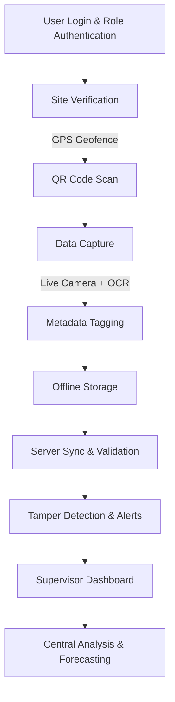

# 🌊 HydroSnap – Secure River Water Level Monitoring

  

---

## 📌 Overview
**HydroSnap** is a mobile-first solution to modernize and secure **river water-level monitoring** using **image processing, geofencing, and cloud integration**.  
It provides reliable, tamper-proof, and scalable data collection to support **flood forecasting, disaster preparedness, and water resource management**.  

---

## 🚩 Problem Statement
Water levels in rivers across India are still largely **monitored manually** by field personnel.  
This process is **time-consuming, error-prone, and vulnerable to tampering**.  

---

## 💡 Our Solution
HydroSnap ensures **authentic and secure water-level reporting** by combining:  
✅ GPS-based **geofencing** for site validation  
✅ **QR code verification** for site authenticity  
✅ **Live photo capture** of gauge posts (no gallery uploads)  
✅ **Image Processing (OCR/AI)** to read water levels automatically  
✅ **Metadata tagging** – timestamp, GPS coordinates, device ID, user ID  
✅ **Tamper detection** – anomaly detection for fake/duplicate readings  
✅ **Offline-first sync** for remote/rural areas  
✅ **Dashboard integration** for supervisors & central analysts  

---

## ✨ Features
- 🌍 **Location Validation** – Warns if user is outside monitoring site radius.  
- 📷 **Camera Enforcement** – Captures live image for each reading.  
- 🤖 **AI Assistance** – Detects & suggests water level from gauge photo.  
- 🛰️ **Metadata Traceability** – Stores GPS, timestamp, and device ID.  
- 📡 **Offline Mode** – Readings saved locally & synced when online.  
- 👥 **Role-based Access** – Field staff, supervisors, analysts, public.  
- 🔒 **Tamper Detection** – Alerts for skipped/fake readings or GPS spoofing.  
- 📊 **Cloud Dashboard** – Supervisors track data across multiple sites.  

---

## 🏗️ Tech Stack
**Mobile (Android)**: Kotlin, Jetpack Compose, CameraX, Room, ZXing (QR Scanner)  
**Backend**: FastAPI / Node.js, REST APIs, JWT Auth  
**Database**: PostgreSQL + PostGIS, Cloud Object Storage (S3/GCS/Azure)  
**Image Processing**: OpenCV, Tesseract OCR, ML (YOLO/CRNN for gauge reading)  
**Dashboard**: React, Mapbox/Leaflet, TailwindCSS  
**Cloud Infra**: AWS / GCP / Azure (Dockerized, CI/CD via GitHub Actions)  

---

## 📊 Workflow

---

## 👥 Team: GrayCode

| Name            | Role                          |
|-----------------|-------------------------------|
| [`Mohsin Ansari`](https://github.com/mohsinansari0705)   | Model Integration & Backend |
| [`Rohit Yadav`](https://github.com/RohityadavGG)     | Data & Visualizations       |
| [`Ayush`](https://github.com/ayush-code303)     | Backend Development       |
| [`Prerna Verma`](https://github.com/prerna-verma29)     | UI/UX       |
| [`Payal Katara`](https://github.com/Payal-katara)     | UI/UX & R&D       |
| [`Kunal Singh`](https://github.com/Kunal-Singh76)     | Testing & Reporting       |

---